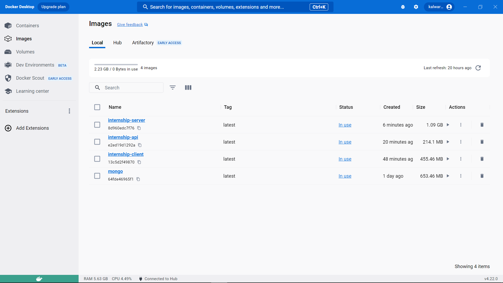
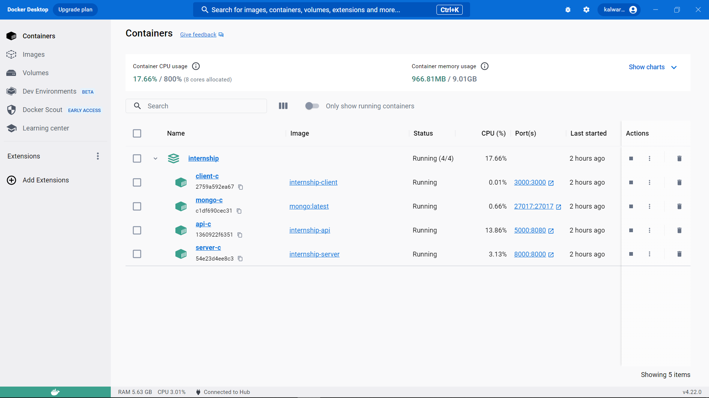
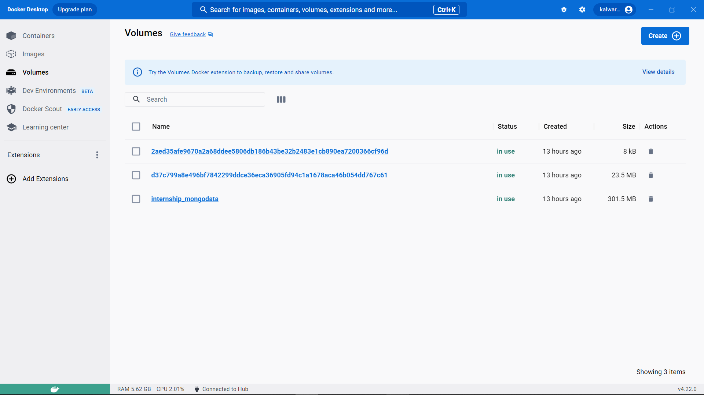

# Progressive Web App with React, NodeJs, ExpressJs, Django, MongoDB, and Docker 

This is a project that demonstrates the integration of a Progressive Web App (PWA) frontend with an ExpressJS backend and a Django API for ngrams comparison using NLTK.

## Project Description

This project showcases the seamless integration of a Progressive Web App (PWA) frontend with an ExpressJS backend and utilizes a Django API for performing ngrams comparison using the Natural Language Toolkit (NLTK).

The PWA frontend allows users to interact with the application interface, while the ExpressJS backend handles the business logic and data processing. The Django API serves as an interface between the frontend and the NLTK library, enabling efficient ngrams comparison.

Each component, including the React PWA frontend, ExpressJS backend, and Django API, has been containerized using Docker for easy deployment and scalability.


### Directory Structure
  - api: Contains the ExpressJS backend API code.
  - client: Contains the React ReactJS frontend code.
  - server: Contains the Django API code.

### Checklist of Tasks Completed

  - [x] Created an ExpressJS backend.
  - [x] Created a React PWA frontend that communicates with the backend.
  - [x] Implemented logging of frontend connections and text insertion in the ExpressJS backend.
  - [x] Integrated the Django API for ngrams comparison using NLTK.
  - [x] Created separate repositories and branches for each component and merged them for submission.
  - [x] Bonus: Containerized each component using Docker.

### Demo Video

Watch a short demo video showcasing the functionality and a walkthrough of the code [here](https://drive.google.com/file/d/1ZGVcdRlgI3m0G4FEVIK15vYaRDLZ2ZtO/view?usp=sharing).

### Docker Images and Container Images






## Getting Started

### Prerequisites

- Node.js and npm installed on your machine
- pnpm package manager. 
- Python and Django installed on your machine

### Installation

  1. Install pnpm manager
  ```shell
  npm install -g npm
  ```
  
  2. Clone the repository:
  
  ```shell
  git clone https://github.com/iprime2/Internship-Baavalibuch-React-Express-django
  ```
  
  3. Install dependencies for the api backend:
  
  ```shell
  cd api
  npm install
  ```
  
  5. Install dependencies for the React frontend:
  
  ```shell
  cd client
  pnpm install
  ```
  
  6. Install dependencies for the Django backend:
  
  ```shell
  cd server
  pip install -r requirements.txt
  ```

### Configuration

  1. ExpressJS Backend:
     - create new file `.env`.
     - Create the MongoDB connection URL in the `.env` file `MONGO_URI`.
  
  2. Django API:
     - Update the Django settings in the `settings.py` file, if necessary.
  
  3. React Frontend:
     - Create the `.env` file
     - Create a new variable API_URL to link with ExpressJS backend.

### Usage
  1. Start the ExpressJS backend:

     ```bash
     cd api
     npm start
     ```
     
      The backend will start running on http://localhost:8080.

  2. Start the Django API server:

      ```bash
      cd server
      python manage.py runserver
      ```
      
      The python backend will start running on http://127.0.0.1:8000/

  4. Start the React frontend:

     ```bash
      cd client
      pnpm run start
     ```
     
      The frontend will start running on http://localhost:3000.

  5. Open http://localhost:3001 in your web browser to access the PWA and test the functionality.
  
    
  
  
